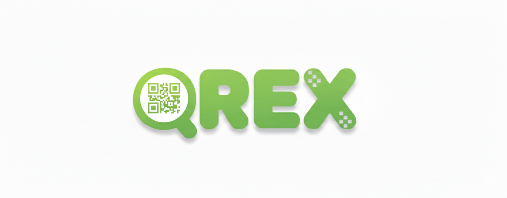

# 🦖 QREX: RAG 기반 QR코드 피싱 방지 서비스

  
  

QREX는 **Spring AI**와 **RAG(검색 증강 생성)** 기술을 활용하여 QR/URL 피싱(큐싱)을 실시간으로 탐지하고 예방하는 보안 플랫폼입니다.
단순한 URL 검사를 넘어, **AI 보안 에이전트**가 탑재되어 사용자에게 긴급 대응 가이드를 제공하고, 자연어 명령으로 게시글 관리 및 분석 기록 조회를 수행하는 **능동형 보안 생태계**를 구축합니다.

---

## 💡 서비스 이름: QRex 선정 이유

**QREX**는 'QR' 코드와 최강의 포식자 공룡인 **T-Rex**의 결합입니다.

T-Rex가 먹이사슬의 모든 위협을 압도했듯, QREX는 교묘하게 숨어있는 QR 피싱 링크를 강력하게 찾아내 제거합니다. 이는 사용자에게 가장 안전한 디지털 경험을 제공하겠다는 저희의 약속을 담은 이름입니다.

---

## ❓ 왜 'RAG (Retrieval-Augmented Generation)' 인가?

QREX는 일반적인 LLM(거대언어모델)의 한계를 극복하고 보안 서비스의 신뢰성을 확보하기 위해 **RAG 아키텍처**를 핵심 기술로 채택했습니다.

### 1. 실시간 위협 탐지 (Real-time Detection)
피싱 사이트는 생성되고 사라지는 주기가 매우 짧습니다. 학습 시점이 고정된 일반 LLM은 "방금 만들어진 피싱 사이트"를 알 수 없습니다.
QREX는 **Google Safe Browsing API**, **실시간 도메인 정보**, **내부 블랙리스트 DB**를 즉시 검색(Retrieval)하여 AI에게 제공함으로써 Zero-day 공격까지 대응합니다.

### 2. 할루시네이션 방지 (Fact-based Response)
보안 문제에 있어 AI의 거짓말(Hallucination)은 치명적입니다.
QREX 에이전트는 Static RAG(이용 가이드)와 Dynamic RAG(게시글/분석 DB)에 저장된 검증된 데이터만을 근거로 답변하며, 근거가 없을 경우 솔직하게 모른다고 답하여 정보의 투명성을 보장합니다.

### 🔄 Tech Migration: [FastAPI](https://github.com/QRex404found/RAG_Fastapi) → Spring AI
> 초기에는 Python(FastAPI)으로 RAG 서버를 구축했으나, 시스템의 통일성과 안정성을 위해 **Spring AI(Java)**로 마이그레이션했습니다.
> * **단일 언어(Java) 환경:** 백엔드와 AI 서버의 언어를 통일하여 관리 복잡성 제거
> * **Spring 생태계 연동:** Spring Security, DI 등 강력한 기능을 AI 파이프라인에 일관성 있게 적용

---

## 🎬 프로젝트 시연 (Demo)

> **"QREX가 실제 QR 피싱을 탐지하고 방어하는 모습을 확인하세요."**

---

## ✨ 주요 특징 (Features)

| 카테고리 | 특징 | 설명 |
| :--- | :--- | :--- |
| **핵심 기술** | **RAG 기반 정밀 분석** | 최신 피싱 패턴 데이터와 실시간 URL 정보를 검색하여 LLM이 정확한 위협 판별을 수행합니다. |
| **상호작용** | **AI Agent 서비스** | 단순 챗봇이 아닌 **행동하는 에이전트**입니다. 자연어로 **"최근 분석 기록 제목 바꿔줘"**, **"이 글 삭제해줘"** 등의 명령을 수행하고 DB를 제어합니다. |
| **실시간성** | **동적 데이터 반영** | 사용자가 작성한 최신 게시글이나 방금 수행한 분석 결과를 벡터 스토어에 실시간으로 동기화하여 AI가 즉시 인지합니다. |
| **커뮤니티** | **피싱 사례 공유** | 사용자들이 피싱 사례를 공유하고 댓글로 소통하며 집단 지성을 통해 피해를 예방합니다. |
| **개인화** | **기록 관리** | 사용자가 검사한 QR 코드의 기록을 저장하고 언제든지 다시 확인할 수 있습니다. |
| **접근성** | **반응형 웹 디자인** | PC, 태블릿, 모바일 등 모든 디바이스에서 최적화된 UI/UX를 제공합니다. |

---

## 🛠️ 팀 역할 및 기술 스택

### 👥 팀명: 404 FOUND
> 겉보기에는 오류와 한계로 보이는 상황 속에서도 해결의 실마리를 찾아내고, 존재하지 않는 것처럼 보였던 가능성을 발굴하겠다는 의지를 담았습니다.

| 역할 | 주도자 | 기술 스택 |
| :--- | :--- | :--- |
| **UI** | 최수연, 심연우 | Figma |
| **Frontend** | 심연우, 최수연 | **React.js, shadcn/ui, Tailwind CSS** |
| **Backend** | 김여민, 심연우 | **Spring Boot, JPA, JWT, OAuth2** |
| **DB** | 최수연, 김여민 | MySQL |
| **RAG & Agent** | 김여민 | **Spring AI, Google Gemini, Chroma DB** |

---

## 🏃 협업 및 프로젝트 관리 (Agile Workflow)

저희 팀은 **Jira**를 도입하여 애자일(Agile) 방법론을 기반으로 프로젝트를 진행했습니다. 주먹구구식 개발을 지양하고, 하루 단위의 **스프린트(Sprint)**를 통해 계획적인 개발과 빠른 피드백 반영을 실천했습니다.

| 워크플로우 | 설명 |
| :--- | :--- |
| **Epic & Story** | '회원 관리', 'RAG 분석' 등 큰 기능을 Epic으로 정의하고, 이를 세부 Task로 쪼개어 관리 |
| **Kanban Board** | `To Do` → `In Progress` → `Done`의 상태 관리를 통해 팀원들의 업무 진행 상황 실시간 공유 |
| **Burndown Chart** | 스프린트 기간 내 소멸 차트를 확인하며 일정 지연 리스크를 사전에 관리 |

---

## 🚀 향후 발전 방향 (Future Roadmap)

단순한 피싱 탐지를 넘어, 금융과 생활 전반을 아우르는 종합 보안 플랫폼으로의 확장을 목표로 합니다.

### 1. 💳 간편결제 보안 적용 확대
QR 기반 간편결제 시장이 성장함에 따라, 악성 결제 링크 유도나 QR 스티커 교체(큐싱) 공격을 차단하는 보안 모듈로 발전시킬 예정입니다. 결제 앱 실행 시 위변조 여부를 사전 탐지하여 사용자의 금융 자산을 보호합니다.

### 2. 🖼️ Computer Vision 기반 위조 탐지
현재의 URL 텍스트 분석을 넘어, 이미지 처리 기술을 도입합니다.
* QR 코드가 기존 이미지 위에 덧씌워진 흔적 탐지
* 물리적 훼손, 재인쇄, 이질적인 픽셀 패턴 분석
이를 통해 육안으로 식별하기 어려운 정교한 위조 QR까지 판별하는 기능을 구축합니다.

### 3. 🤝 통신사·금융기관 API 연동 강화
통신사 및 금융기관과 협력하여, 의심 QR 접속 시 결제나 송금을 원천 차단하는 **Kill-Switch** 체계를 구축합니다. 모바일 백신이나 기본 보안 앱에 QREX 엔진을 탑재하여 실효성을 극대화합니다.

### 4. 📱 포괄적 피싱 대응 플랫폼으로 확장
QR 피싱뿐만 아니라 스미싱(문자), 보이스피싱 등 모바일 환경의 다양한 위협을 통합 분석하는 **All-in-One 모바일 보안 플랫폼**으로 확장하여 사용자 보호 수준을 한 단계 끌어올립니다.

### 5. 🧠 RAG 데이터셋 고도화
RAG(검색 증강 생성) 구조의 이점을 살려, 최신 피싱 사례와 공격 패턴 데이터를 지속적으로 학습시킵니다. 데이터가 쌓일수록 AI의 탐지 정확도가 향상되는 선순환 구조를 확립합니다.

### 6. ⚡ 2-Stage Hybrid AI 분석
비용 효율성과 정확도를 모두 잡기 위한 다단계 분석 모델을 도입합니다.
1.  **1단계:** RAG 기반 모델이 신속하게 위험 여부 선별
2.  **2단계:** '주의/위험' 건에 한해 고성능 AI 모델이 정밀 재검사
이러한 구조를 통해 상황에 따라 스스로 판단 깊이를 조절하는 지능형 보안 시스템으로 발전시킵니다.

---

## ⚙️ 시스템 구성 및 리포지토리 바로가기

QREX는 기능별로 모듈화된 3개의 핵심 시스템으로 구성되어 있으며, 각 시스템은 RESTful API를 통해 유기적으로 연결됩니다.

### 👇 각 시스템의 상세 코드와 문서는 아래 링크를 클릭하세요.

### 🖥️ [프론트엔드 (Frontend) Repository](https://github.com/QRex404found/frontend)
> **사용자 경험(UX) 중심 인터페이스**
> * React 기반의 SPA(Single Page Application) 구조
> * 카메라 QR 스캔 및 갤러리 이미지 분석 UI 구현
> * AI 에이전트와의 실시간 채팅 UI

### 📡 [메인 백엔드 (Main Backend) Repository](https://github.com/QRex404found/backend)
> **비즈니스 로직 및 데이터 관리**
> * 사용자 인증/인가 (JWT, OAuth2)
> * 게시판, 댓글, 분석 기록 CRUD API
> * RAG 서버로의 실시간 데이터 동기화 (Async Event)

### 🧠 [RAG & AI Agent 서버 (Spring AI) Repository](https://github.com/QRex404found/RAG_Springai)
> **지능형 분석 및 추론 엔진**
> * **Spring AI** 기반의 RAG 파이프라인 및 벡터 스토어 구축
> * **Function Calling**을 이용한 도구(Tools) 실행 및 제어
> * AI 에이전트 상세 행동 수칙 및 프롬프트 엔지니어링

---

## 📚 프로젝트 상세 자료 (Documentation)

| 자료 구분 | 내용 요약 | 링크/위치 |
| :--- | :--- | :--- |
| **최종 결과보고서** | 기획 의도, 시스템 설계, RAG 구현 과정 및 프로젝트 최종 성과를 망라한 종합 보고서 | [최종 결과보고서](https://github.com/QRex404found/documents/tree/9344402b75cba7696f8aad594b2e013b1642a1a6/%EC%8B%9C%EC%8A%A4%ED%85%9C%EC%A0%95%EC%9D%98%EC%84%9C) |
| **시스템 정의서** | 프로젝트의 전체적인 요약, 주요 기능, 개발 기간, 팀원 정보 | [시스템 정의서](https://github.com/QRex404found/documents/tree/9344402b75cba7696f8aad594b2e013b1642a1a6/%EC%8B%9C%EC%8A%A4%ED%85%9C%EC%A0%95%EC%9D%98%EC%84%9C) |
| **시스템 아키텍처** | 사용자, 프론트, 백, 분석 서버, DB 간의 상호작용 다이어그램 | [시스템 아키텍처](https://github.com/QRex404found/documents/blob/b530d33e989be9eb29846f038d3f6a0566173246/system_architecture.jpg) |
| **요구사항 정의서** | 서비스의 목적 및 범위, 기능적/비기능적 요구사항, 인터페이스 정의 등 프로젝트 개발의 기준이 되는 상세 명세서 | [요구사항 정의서](https://github.com/QRex404found/documents/tree/9344402b75cba7696f8aad594b2e013b1642a1a6/%EC%9A%94%EA%B5%AC%EC%82%AC%ED%95%AD%EC%A0%95%EC%9D%98%EC%84%9C) |
| **기능적 요구사항** | 백엔드와 프론트엔드의 각 기능별 상세 요구사항 | [기능적 요구사항](https://github.com/QRex404found/documents/blob/3df098751e2b3dc922981fa9b1210423626b738a/%EA%B8%B0%EB%8A%A5%EC%A0%81%20%EC%9A%94%EA%B5%AC%EC%82%AC%ED%95%AD.md) |
| **DB 스키마 (ERD)** | USER, ANALYSIS, BOARD, COMMENT 테이블의 관계 및 컬럼 정보 | [ERD](https://github.com/QRex404found/documents/blob/b530d33e989be9eb29846f038d3f6a0566173246/db/db_final.png) |
| **팀 활동 일지** | 팀 미팅 내용, 주요 결정 사항 및 진행 상황 기록 | [회의록 Repository](https://github.com/QRex404found/meeting_notes) |
| **Figma 디자인** | 사용자 인터페이스의 전체적인 레이아웃 및 디자인 | [Figma URL](https://embed.figma.com/design/nLM3q74eSdsI1o1IhpKZ7L/QREX?node-id=0-1&t=aedu6NYkxjKdHAXR-1&embed-host=notion&footer=false&theme=system) |
| **Notion 페이지** | 프로젝트의 모든 상세 자료가 정리된 Notion 페이지 | [Notion URL](https://www.notion.so/QRex-20e89adac92c802b9355fedbfbbcac9f?source=copy_link) |
| **최종발표 자료** | 프로젝트의 최종발표를 위한 문제 정의부터 솔루션 도출, 아키텍처 설계 및 시연 결과 자료 | [PPT](https://www.notion.so/QRex-20e89adac92c802b9355fedbfbbcac9f?source=copy_link) |

---

## 💭 프로젝트 회고 (Retrospective)

> **"문제의 발견에서 기술적 해결, 그리고 성장으로"**

팀원들과 함께 사회적으로 대두되는 문제들을 탐색하던 중 **'QR 피싱'** 문제에 주목하게 되었고, 이를 해결하기 위한 우리만의 독창적인 서비스를 기획하며 프로젝트는 시작되었습니다.

**🧩 기술의 통합과 협업**
프론트엔드, 백엔드, AI 모델, 데이터베이스 등 서로 다른 기술 스택을 하나의 유기적인 서비스로 통합하는 과정은 결코 쉽지 않았습니다. 하지만 팀원들과 함께 거대한 문제를 작은 단위로 분해하고, 하나씩 해결책을 찾아가며 **'소프트웨어 개발 생명주기(SDLC)'** 전반을 경험적으로 이해할 수 있었습니다.

**🏗️ 주도적인 환경 구축**
특히 누군가 만들어둔 환경이 아닌, 직접 기술 스택을 선정하고 서버 환경을 밑바닥부터 구축해 본 경험은 매우 값졌습니다. 이는 단순한 코드 작성을 넘어, **"서비스가 동작하기 위해 필요한 전체 아키텍처를 바라보는 시각"**을 키워주었습니다.

이 프로젝트는 저희에게 단순한 결과물이 아닙니다. 앞으로 어떤 분야를 더 깊이 파고들어야 할지, 개발자로서 어떻게 소통하고 협업해야 하는지에 대한 방향을 잡아준 소중한 **이정표**가 되었습니다.

